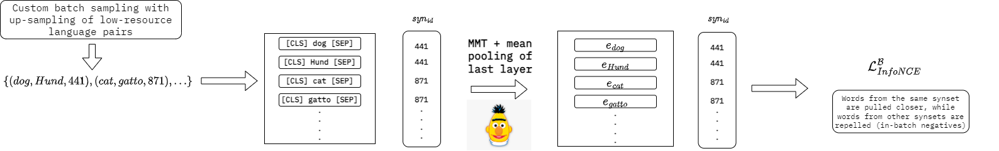

# Massively Multilingual Lexical Specialization of Multilingual Transformers

This is the codebase for the paper titled [Massively Multilingual Lexical Specialization of Multilingual Transformers](https://aclanthology.org/2023.acl-long.426/).

## Models and dataset

We release the main dataset in the HuggingFace Hub. 
We additionally release checkpoints of Babel-FT for both mBERT and XLM-R.

- [Dataset](https://huggingface.co/datasets/umanlp/babelbert-dataset)
- [BabelFT-mBERT](https://huggingface.co/umanlp/babelbert-ft-mbert)
- [BabelFT-XLM-R](https://huggingface.co/umanlp/babelbert-ft-xlm-r)

## Abstract

While pretrained language models (PLMs) primarily serve as general-purpose text encoders that can be fine-tuned for a wide variety of downstream tasks, recent work has shown that they can also be rewired to produce high-quality word representations (i.e., static word embeddings) and yield good performance in type-level lexical tasks. While existing work primarily focused on the lexical specialization of monolingual PLMs with immense quantities of monolingual constraints, in this work we expose massively multilingual transformers (MMTs, e.g., mBERT or XLM-R) to multilingual lexical knowledge at scale, leveraging BabelNet as the readily available rich source of multilingual and cross-lingual type-level lexical knowledge. Concretely, we use BabelNet's multilingual synsets to create synonym pairs (or synonym-gloss pairs) across 50 languages and then subject the MMTs (mBERT and XLM-R) to a lexical specialization procedure guided by a contrastive objective. We show that such massively multilingual lexical specialization brings substantial gains in two standard cross-lingual lexical tasks, bilingual lexicon induction, and cross-lingual word similarity, as well as in cross-lingual sentence retrieval. Crucially, we observe gains for languages unseen in specialization, indicating that multilingual lexical specialization enables generalization to languages with no lexical constraints. In a series of subsequent controlled experiments, we show that the number of specialization constraints plays a much greater role than the set of languages from which they originate.




## Installing dependencies

This project requires [poetry](https://python-poetry.org/) ([why](https://blogs.sap.com/2022/05/08/why-you-should-use-poetry-instead-of-pip-or-conda-for-python-projects/)), please install the dependencies using the provided pyproject.toml file by simply running in this folder:

```poetry install```

**Note**: the code is not fully tested yet, so there might be some issues with the dependencies.


## Training

This project uses Hydra, therefore all parameters are defined in yaml config files. 
The main file is ``configs/train.yaml``, models, datasets and loggers are defined in 
``configs/models``, ``configs/datasets`` and ``configs/loggers``.

For training execute

```poetry run python train.py```

to simply run the script with the default settings defined in ``configs/train.yaml``

To run it with another config file (to be placed in configs folder)

```poetry run python train.py --config-name my_train_conf.yaml```

It is also possible to override parameters in line:


```poetry run python train.py model.learning_rate=0.0001```

## Evaluation

In a similar fashion to training, evaluation can be run with


```poetry run python evaluate.py```

using the ``evaluate.yaml`` default config. One can override the checkpoint as follows:

```python evaluate.py ckpt=PATH_TO_CKPT```.

To evaluate one checkpoint on all tasks, simply use multi-runs (-m)

```python evaluate.py -m task=xlsim,bli,tatoeba ckpt=PATH_TO_CKPT```

## BabelNet extraction

Coming soon!

## Licence

Our dataset is a processed version of BabelNet v5.0 downloaded from https://babelnet.org, made available with the BabelNet Non-Commercial License (see https://babelnet.org/full-license).

Our code is licensed under the MIT license.

## Citation

If you use this code, please cite the following paper:

```
@inproceedings{green-etal-2023-massively,
    title = "Massively Multilingual Lexical Specialization of Multilingual Transformers",
    author = "Green, Tommaso  and
      Ponzetto, Simone Paolo  and
      Glava{\v{s}}, Goran",
    booktitle = "Proceedings of the 61st Annual Meeting of the Association for Computational Linguistics (Volume 1: Long Papers)",
    month = jul,
    year = "2023",
    address = "Toronto, Canada",
    publisher = "Association for Computational Linguistics",
    url = "https://aclanthology.org/2023.acl-long.426",
    pages = "7700--7715",
    abstract = "While pretrained language models (PLMs) primarily serve as general-purpose text encoders that can be fine-tuned for a wide variety of downstream tasks, recent work has shown that they can also be rewired to produce high-quality word representations (i.e., static word embeddings) and yield good performance in type-level lexical tasks. While existing work primarily focused on the lexical specialization of monolingual PLMs with immense quantities of monolingual constraints, in this work we expose massively multilingual transformers (MMTs, e.g., mBERT or XLM-R) to multilingual lexical knowledge at scale, leveraging BabelNet as the readily available rich source of multilingual and cross-lingual type-level lexical knowledge. Concretely, we use BabelNet{'}s multilingual synsets to create synonym pairs (or synonym-gloss pairs) across 50 languages and then subject the MMTs (mBERT and XLM-R) to a lexical specialization procedure guided by a contrastive objective. We show that such massively multilingual lexical specialization brings substantial gains in two standard cross-lingual lexical tasks, bilingual lexicon induction and cross-lingual word similarity, as well as in cross-lingual sentence retrieval. Crucially, we observe gains for languages unseen in specialization, indicating that multilingual lexical specialization enables generalization to languages with no lexical constraints. In a series of subsequent controlled experiments, we show that the number of specialization constraints plays a much greater role than the set of languages from which they originate.",
}
```

